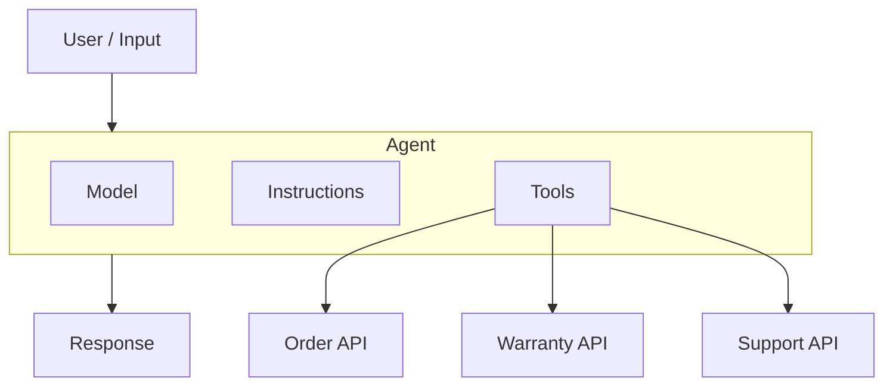
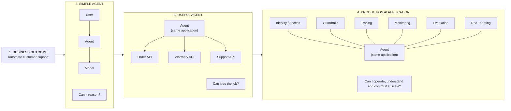
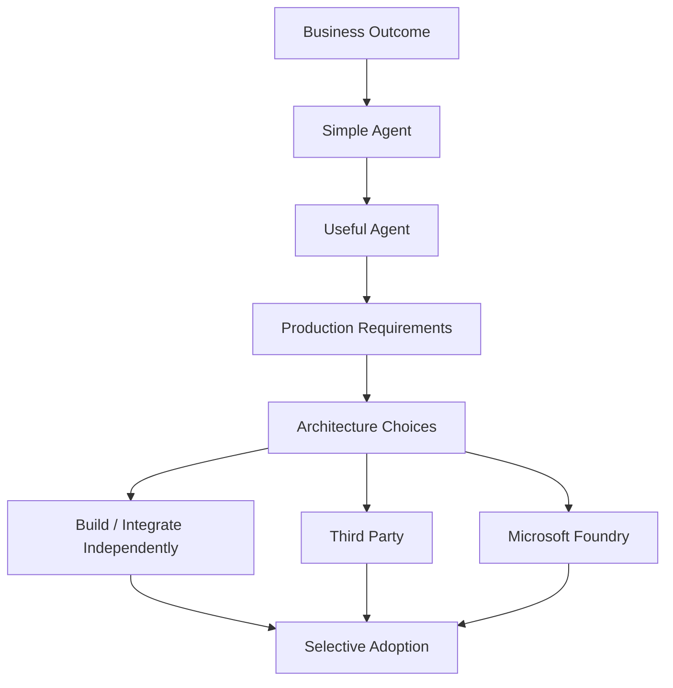
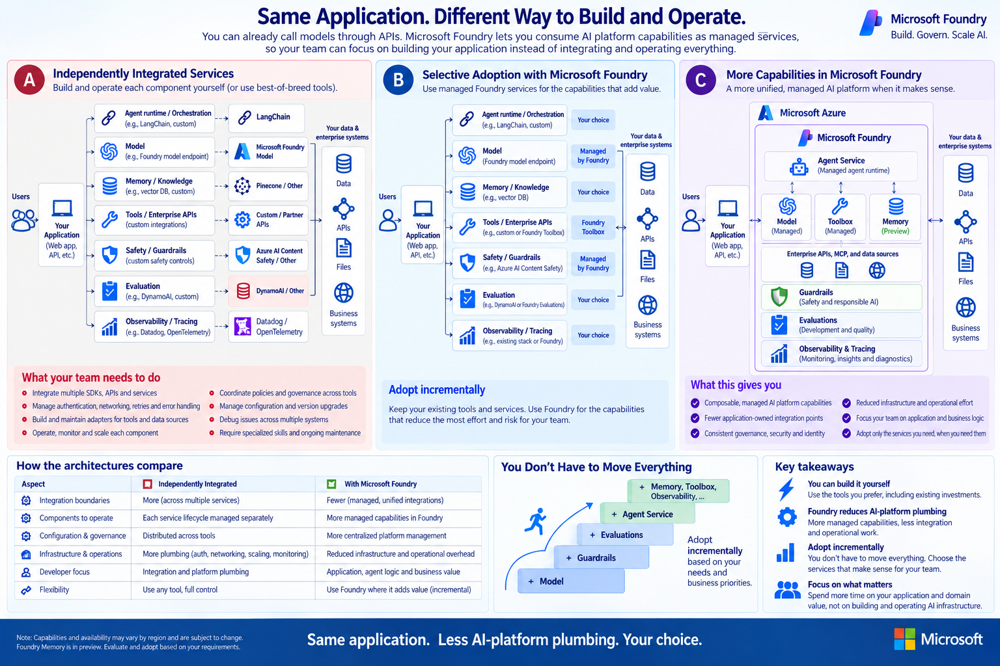
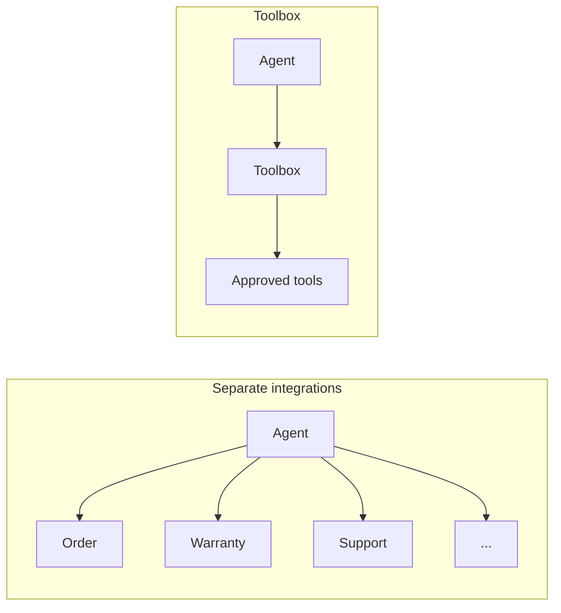
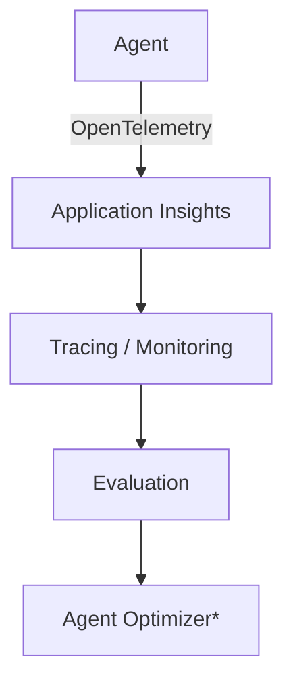

# Foundry Beyond Models

**What changes between calling a model and operating an AI application in production?**

This repository follows a simple support agent from prototype toward production. Given the question, **"Is Item A under warranty, and how do I contact support?"**, it explores where a team can build or integrate capabilities independently and where it might selectively consume Microsoft Foundry capabilities.

Foundry is one architectural option, not a requirement for building an agent or a destination for every part of an AI application.

## What Is an Agent?

An agent combines a model with instructions and tools so it can reason about a request and interact with external systems.

## Demo

1. **Architecture:** this README and [architecture choices](docs/architecture/03-deeper-foundry.md) describe the broader incremental adoption story.
2. **Code comparison:** [demo/comparison/foundry_development_comparison.py](demo/comparison/foundry_development_comparison.py) compares Tools, Guardrails, and Evaluations around a shared agent definition and runner.
3. **Optional runnable sample:** [demo/model_demo.py](demo/model_demo.py) makes a real model call. The [technical sample guide](docs/model-sample.md) covers setup, response interpretation, and a separate offline evaluation exercise.

## From Business Outcome to Production

A model endpoint is enough to start. As an AI application moves toward production, additional responsibilities emerge around tool integration, identity, safety, quality, observability, and operations.

## What Changes in Production?

| Build the agent | Operate the agent |
| --- | --- |
| Model | Tracing |
| Tools | Monitoring |
| Knowledge | Evaluation |
| Memory | Guardrails |
| Runtime | Red Teaming |
| **Can it do the job?** | **Can I understand, control and improve it at scale?** |

Not every application needs every capability. Requirements grow according to the use case, scale, risk, and operational needs.

## Architecture Choices

Foundry is an architectural option for selected platform capabilities, not a mandatory destination.

The question is not whether these capabilities can be built independently—they can. The question is which AI-platform capabilities the application team wants to build, integrate, govern, and operate itself.

## Where Microsoft Foundry Fits

The same application can be implemented with independently integrated services, selective Foundry adoption, or a broader set of managed Foundry capabilities. These are architectural choices—not a maturity ladder.

**Same application. Less separately integrated AI-platform plumbing. Your choice.**

Capabilities can be adopted independently when they fit the application's requirements. Managed services change responsibility boundaries; they do not remove the need for application logic, configuration, authorization, testing, governance, or operations.

### Example 1 — Scaling Tools

A few individually integrated tools are manageable, but the agent-facing integration surface and model context can become more complex as the tool catalog grows.

**The underlying APIs still exist. What changes is the agent-facing consumption and governance surface.**

Tool Search can be considered as a scaling optimization when exposing the entire catalog to the model is undesirable. Its fit and current availability should be validated for the target environment; this repository makes no performance claim.

See the existing [code comparison](demo/comparison/foundry_development_comparison.py) for separate MCP connections and a single Toolbox consumer connection. The sample is architecture-as-code and does not provide a live Toolbox deployment.

### Example 2 — Observe, Evaluate, Improve

| Capability | Question |
| --- | --- |
| Tracing | What happened? |
| Monitoring | Is the system healthy? |
| Evaluation | How well did the agent behave? |
| Optimization | Can we improve it? |

**OpenTelemetry is not replaced by Foundry. It remains the telemetry standard and can span Foundry and other hosting environments.**

`*` Agent Optimizer is shown as an optional optimization step. Confirm its current availability and fit before adoption.

Evaluation remains an offline quality workflow in this repository, outside `agent.run()`. Use the same versioned dataset and aligned criteria when comparing providers; scores from different evaluators are not automatically equivalent. See the [code comparison](demo/comparison/foundry_development_comparison.py) and [development guide](docs/development-comparison.md).

## Scope and Caveats

The diagrams are conceptual, not deployed-resource diagrams. Microsoft Agent Framework is the framework; Agent Service is an optional managed runtime. Existing third-party and custom implementations remain valid, and no architecture here establishes fewer total lines of code or less total complexity.

The code comparison is not a runnable application: executing it only prints a notice. External HTTP contracts are illustrative, not vendor APIs. Guardrails require separate policy assignment and coverage tests. No live Toolbox integration, telemetry configuration, or hosted-agent deployment is supplied.

See [technical assumptions and references](docs/architecture-validation.md) for capability boundaries, status notes, and source links.
