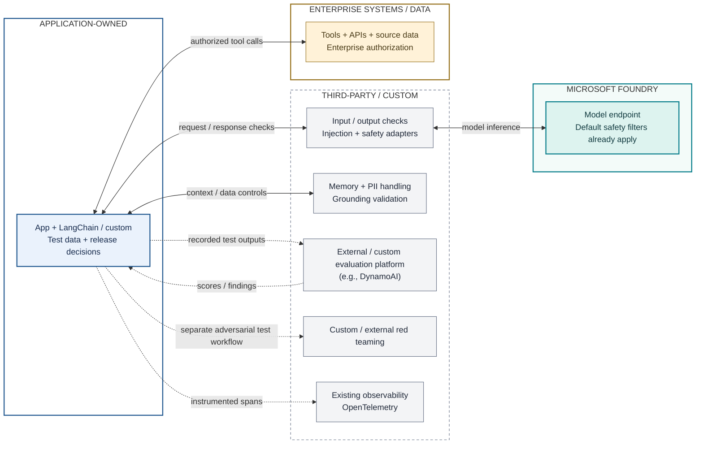

# A. Model Access, Composable Stack

**Message:** We already consume the model here. The organization chooses how to integrate and operate everything around it.



**Read the visual:** Solid arrows are runtime exchanges; dotted arrows are offline evidence or telemetry. Boundaries identify operational ownership, not network isolation or billing boundaries. Grouped checks are responsibilities, not a prescribed serial algorithm. The application includes the user-facing entry point.

## ASCII Fallback

```text
APPLICATION-OWNED          THIRD-PARTY / CUSTOM       MICROSOFT FOUNDRY
+-------------------+     +---------------------+    +--------------------+
| UI + app          |<--->| Injection / safety  |<-->| Model endpoint     |
| Existing runtime  |     | Input/output checks |    | Default filtering  |
+-------------------+     +---------------------+    +--------------------+
   |       |    |
   |       |    +<------> Memory / PII / grounding [THIRD-PARTY / CUSTOM]
   |       +---- spans -> Existing observability  [THIRD-PARTY / CUSTOM]
   +<------------------> Tools / APIs / data      [ENTERPRISE SYSTEMS]

App outputs ..> External / custom evaluation platform (e.g., DynamoAI)
            ..> Customer release gate
App ..> Custom / external red teaming (separate test workflow)
```

## Architectural Reading

This is a valid architecture, especially when the organization already has effective security middleware, evaluation platforms, and operating practices. It is not intentionally made inefficient: an external platform may already consolidate several of these responsibilities. DynamoAI is an illustrative evaluation-platform choice, not a claim about its feature parity or limitations.

The integration work is concrete: wire selected safety services into input/output handling, normalize results, choose fail/allow behavior, authenticate calls, export evaluation datasets, operate jobs, and maintain compatible configurations. These responsibilities may belong to a shared platform team, not every application developer.

**Baseline correction:** Model-only adoption does not disable Foundry's default safety protections. The comparison is default endpoint protections plus separately operated controls versus deliberately configured, reusable Foundry controls. Never present a deliberately unsafe baseline.

## Customer Still Owns

- Application logic, prompts, orchestration, tool approvals, retries, timeouts, and user experience.
- Enterprise permissions and tool-side authorization; model output is not permission to execute an action.
- PII minimization before model calls, memory scoping and retention, source quality, and output handling.
- Evaluation datasets, ground truth, risk taxonomy, thresholds, reviewer judgment, release gates, and remediation.
- Integration lifecycle, identities, secrets where unavoidable, telemetry redaction, monitoring, and operational cost.

## Selective Adoption

Model access is already managed here. [Architecture B](02-selective-foundry.md) changes ownership of selected safety checks and evaluation execution/reporting while retaining the surrounding application. Diagram box counts are not a cost metric.

Sources: [Guardrails overview and defaults](https://learn.microsoft.com/azure/foundry/guardrails/guardrails-overview), [Foundry integrations with external orchestration](https://learn.microsoft.com/agent-framework/integrations/by-provider/microsoft-foundry). See [validation and caveats](../architecture-validation.md).