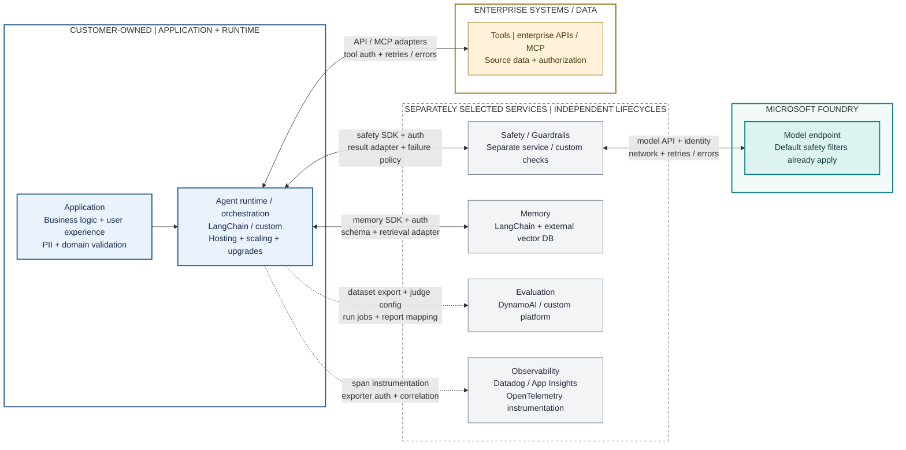

# A. Model Access, Composable Stack

**Flexible components, independently operated boundaries.** The same application can be built from separate services. Foundry supplies the model; the customer or shared platform team connects and operates the surrounding stack. This is a valid choice, especially where those integrations already work well.



**Read the visual:** Each labeled connection is integration work: API/SDK compatibility, authentication, adapters, network access, errors and telemetry. Solid arrows show logical runtime exchanges, not a prescribed serial safety algorithm; dotted arrows show offline evaluation or telemetry. Component boxes represent selected services, not necessarily customer-hosted infrastructure. Vendors may manage their own services; the customer still operates the cross-service integrations. Existing red teaming is a separate test workflow, omitted for readability.

| Across these boundaries | Customer / shared platform responsibility |
|---|---|
| Connect | SDKs/APIs, identities, permissions, adapters and network paths |
| Handle failures | Timeouts, retries, result normalization and fallback behavior |
| Operate | Deployment/scaling of owned runtimes and adapters; service health and telemetry correlation |
| Change safely | Configuration, schemas, dependency upgrades and cross-service regression tests |

**More independently operated services -> more interfaces and lifecycles to coordinate -> more integration and operational ownership.** Existing shared platforms can already reduce this work; the comparison is not a claim that separate services are inherently inefficient.

## ASCII Fallback

```text
APPLICATION -> LANGCHAIN / CUSTOM RUNTIME [customer hosts + scales]
                          |
                          +-- safety SDK/auth --> separate/custom safety service
                          |                            +-- model API --> Foundry model
                          |                                              (default filters)
                          +-- memory SDK/auth --> LangChain / external vector DB
                          +.. export/jobs ......> DynamoAI / custom evaluation
                          +.. spans/exporters ..> Datadog / App Insights / OTel
                          +-- tool adapters ----> enterprise APIs / MCP

ACROSS CONNECTIONS: identities + networking + retries/errors + configuration
OPERATE: owned deployments/scaling + monitoring + upgrades + compatibility
BENEFIT: flexible service choice; existing investments can remain
```

## Architectural Reading

This is a valid architecture, especially when the organization already has effective security middleware, evaluation platforms, and operating practices. It is not intentionally made inefficient: an external platform may already consolidate several of these responsibilities. DynamoAI is an illustrative evaluation-platform choice, not a claim about its feature parity or limitations.

The integration work is concrete: wire selected safety services into input/output handling, normalize results, choose fail/allow behavior, authenticate calls, export evaluation datasets, operate jobs, and maintain compatible configurations. These responsibilities may belong to a shared platform team, not every application developer.

**Baseline correction:** Model-only adoption does not disable Foundry's default safety protections. The comparison is default endpoint protections plus separately operated controls versus deliberately configured, reusable Foundry controls. Never present a deliberately unsafe baseline.

## Customer Still Owns

- Application logic, prompts, orchestration, tool approvals, retries, timeouts, and user experience.
- Enterprise permissions and tool-side authorization; model output is not permission to execute an action.
- PII minimization before model calls, memory scoping and retention, source quality, and output handling.
- Evaluation datasets, ground truth, risk taxonomy, thresholds, reviewer judgment, release gates, and remediation.
- Integration lifecycle, identities, secrets where unavoidable, telemetry redaction, monitoring, and operational cost.

## Selective Adoption

Model access is already managed here. [Architecture B](02-selective-foundry.md) changes ownership of selected safety checks and evaluation execution/reporting while retaining the surrounding application. Diagram box counts are not a cost metric.

Sources: [Guardrails overview and defaults](https://learn.microsoft.com/azure/foundry/guardrails/guardrails-overview), [Foundry integrations with external orchestration](https://learn.microsoft.com/agent-framework/integrations/by-provider/microsoft-foundry). See [validation and caveats](../architecture-validation.md).