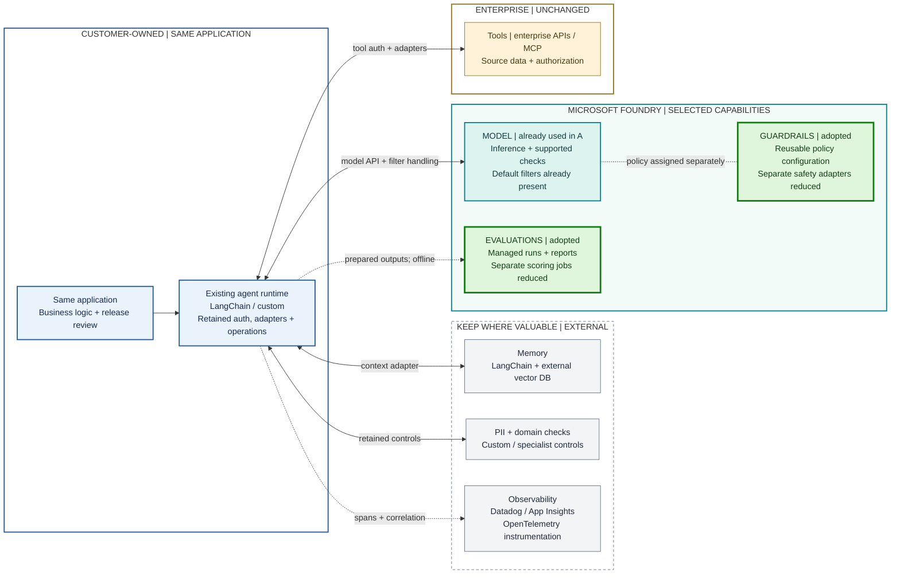
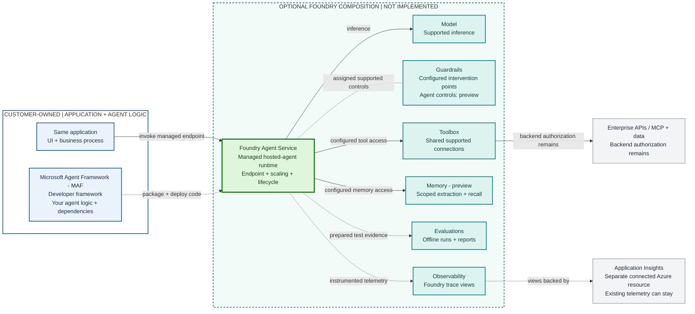

# B. Selective Foundry Adoption

**Existing Foundry model access plus two selected capabilities, Guardrails and Evaluations.** This example organization chooses Foundry for supported model-safety requirements and offline scoring/reporting that it would otherwise integrate separately. The application, LangChain/custom orchestration, enterprise tools, memory and existing observability stay external. This illustrates potential consolidation, not a requirement to migrate an existing platform.

**Scenario assumption:** Supported model controls meet the selected safety requirements, and Foundry's evaluators meet the selected measurement requirements. The customer does not need a separate evaluation platform for this scope. These are assumptions for the architecture comparison, not measured savings or a completed compatibility assessment.

| SEPARATELY ASSEMBLED IN A | SELECTIVELY MANAGED IN B |
|---|---|
| Safety-service SDKs, authentication, adapters and failure handling | Supported policy checks on the existing model call; consume its filter outcomes |
| Separate scoring jobs, judge invocation and report aggregation | Managed evaluation execution and reports; supply datasets and review results |
| Independently configured services and upgrade lifecycles | Reusable policies and evaluation configuration for the selected scope |
| Flexible component choice; more integration boundaries to operate | Fewer application-owned boundaries where coverage matches; retained components still work |

## Same Application, Selected Replacements



**Legend:** Green blocks replace selected independently operated integrations; teal is the already-managed model; gray components are retained. Solid arrows are runtime exchanges. The dotted Model-Guardrails line is a configuration association; dotted arrows show offline evidence or telemetry, not a serial request pipeline. The connected blocks compose through configured interfaces, not automatic wiring or one universal API. Boundaries indicate operating responsibility, not network isolation, billing or transfer of accountability. Judge configuration, input mapping and customer review of scores/reasons remain. Existing red teaming is unchanged and omitted here for readability.

**Read the A-to-B difference:** A's separate injection/safety adapter path is unnecessary for the supported checks covered here. A's **External / custom evaluation platform (e.g., DynamoAI)** is not introduced for the selected scoring/reporting scope; B uses Foundry Evaluations instead. Neither change removes PII controls, tool authorization, domain validation, red teaming or telemetry. See the consolidation table below for the precise work avoided and retained.

**Existing investment alternative:** A customer with a mature external/custom evaluation platform may retain it and adopt only Guardrails, or use Foundry scoring selectively where it adds evidence. B does not require that platform to migrate, does not assume feature parity with DynamoAI, and does not imply a native connector or automatic result synchronization. The main diagram shows the chosen Foundry evaluation path, not two mandatory parallel evaluation systems.

**Guardrails is not a separate universal runtime API in this diagram.** The policy node represents management configuration; applicable controls execute at the model endpoint. The dotted assignment arrow is not a per-request safety-service call. Inference outcomes include API-specific annotations, blocked responses or errors that the application must handle.

## ASCII Fallback

```text
SAME APPLICATION -> EXISTING LANGCHAIN / CUSTOM RUNTIME
                         |
                         +-- model API --> [FOUNDRY MODEL]
                         |                       ^ assigned policy
                         |                 [FOUNDRY GUARDRAILS]
                         +.. test outputs >[FOUNDRY EVALUATIONS]
                         |                       .. scores -> app review
                         +-- context adapter ---> external memory
                         +-- retained controls -> PII / domain checks
                         +-- tool auth/adapters > enterprise APIs / MCP
                         +.. spans/correlation -> existing observability

REDUCED: covered safety adapters; selected scoring/report infrastructure
RETAINED: external integrations; configuration; errors; data + release review
```

## Optional Next Step: Agent Logic, Not Runtime Infrastructure

**Microsoft Agent Framework (MAF) is the developer framework; Foundry Agent Service is the managed runtime.** MAF provides agent/workflow abstractions, not managed hosting by itself. An application can keep its existing runtime, run MAF externally, or package compatible MAF agent code as a hosted agent. This extension is conceptual, not part of the working sample. It is not required to adopt Guardrails or Evaluations.



**Read the composition:** The deployment arrow transfers code to its host; MAF is not an extra network hop or a cloud service. Solid arrows show configured runtime use; the dotted Guardrails line is a policy association, while dotted arrows show deployment, offline evaluation or telemetry. These capabilities are independently selectable, not a prewired bundle. Agent intervention points and Memory have preview/compatibility limits. Foundry trace views require separately connected Application Insights; instrumentation, retention and costs remain. Other compatible frameworks can use Agent Service; external MCP clients can use Toolbox without moving runtime. Existing memory or specialist services can remain on separately integrated paths, omitted from this optional view. See [C's composition and ownership view](03-deeper-foundry.md) for the fuller boundary.

```text
CUSTOMER BUILDS:  MAF agent logic -- package/deploy --> Agent Service
SAME APP:        invoke managed endpoint -----------> managed runtime
                                                        |-- Model
                                                        |-- Toolbox -> APIs/MCP
                                                        |-- Memory (preview)
                assign Guardrails ......................|
                prepared evidence ......................+.. Evaluations
                instrumented telemetry .................+.. Foundry trace views
                                                            + separate App Insights
Framework choice != hosting choice. Keep external components where useful.
```

| Work potentially transferred | Work that stays with the application team |
|---|---|
| Agent endpoint hosting, scaling and runtime lifecycle | MAF agent/business logic, dependencies, application deployment and recovery |
| Repeated supported tool connection/authentication plumbing | Tool contracts, connection configuration, permissions and backend authorization |
| Selected memory pipeline and AI trace-view infrastructure | Scope, consent, instrumentation, networking, retention and end-to-end monitoring |

**Foundry does not eliminate architecture. It reduces the amount of AI-platform integration and operational plumbing the application team has to build and maintain**, where supported managed capabilities replace work the team would otherwise operate. More consistent platform management is not one configuration, one API, or zero operational ownership.

## Potential Consolidation

| Capability Foundry covers in this scenario | A: independently integrated approach | B: integration avoided or reduced | Customer still owns |
|---|---|---|---|
| Supported model content-safety and user-prompt attack checks | Separate safety-service invocations, service authentication, retries/timeouts and result-normalization adapters around model calls | These separate invocations and their adapters are unnecessary for checks enforced on the supported inference path. The application consumes the model's filter outcomes instead. | Policy creation/assignment, inference authentication, block/error/stream handling, coverage tests and all controls outside the policy's supported scope |
| Selected offline evaluators and run/report management | Introduce an external/custom evaluation platform, or maintain custom scoring-job execution and report aggregation | Choose Foundry's evaluators, run execution and reports rather than introducing that separate platform integration or operating those custom jobs. This is not elimination of all evaluation work. | Test harness, datasets/context, field mappings, judge configuration/cost, calibration, result review/export and release gates |
| Reusable configuration for the selected scope | Maintain independent safety-service settings and scoring/report configurations | Supported deployments can share a named policy; Foundry datasets and evaluation configurations can be reused within their supported scope. | Version/change control, permissions, regression tests, service dependencies and operational cost |

**Why useful without deeper adoption:** Supported checks attach to the model deployment, and offline evaluation accepts externally produced outputs. Neither requires moving LangChain/custom orchestration into Agent Service. Consolidation is at the selected safety and evaluation integrations, not at the application, data, tool or telemetry boundaries.

**Why A remains valid:** Existing shared platforms may already consolidate these responsibilities effectively. The diagram identifies potential work avoided for this customer, not a measured cost reduction or a claim that Foundry is superior to a mature external platform.

## Adoption Test

Before applying B to a real customer, verify the scenario assumptions. For Guardrails, identify a specific policy requirement not already satisfied by deployment defaults. Compare coverage, false positives/negatives, blocking/streaming behavior, latency, change control and cost. Retire existing adapters only for demonstrated coverage and with explicit approval; do not remove defense-in-depth controls merely because they look duplicative. If defaults already meet the requirement, creating a named policy alone is not incremental capability.

For Evaluations, identify required metrics and reporting. A customer without a mature platform can choose Foundry instead of introducing another one. A customer with an established platform can keep it; a supplementary Foundry pilot must justify added export/mapping, judge cost, retention/access and reviewer reconciliation. Different evaluator scales and rubrics are not interchangeable. Neither a migration nor dual operation is required by this architecture.

## Guardrail Boundary

**API scope:** Multiple controls in one policy and enforcement integrated with supported model inference are documented. A universal callable API that replaces the application's injection, PII, safety, groundedness and tool-control pipeline is not established by these sources.

Foundry groups supported model guardrail controls in a configurable policy and applies them on supported model-inference requests. Policy management and deployment assignment are separate from inference; controls outside that supported path remain separately integrated.

| Meaning of "integrated" | Verified behavior |
|---|---|
| Configure multiple controls together | **Yes.** The portal manages a named collection of controls. The ARM RAI policy REST schema has a `properties.contentFilters` array; its example combines standard content categories, user-prompt attack protection and protected-material controls. This is management configuration, not submission of user text for classification. |
| Assign the policy and execute inference in the same API operation | **No for the documented deployment-policy path.** Policy create/update targets `.../raiPolicies/{name}`. Deployment create/update separately sets `properties.raiPolicyName`. The application then calls the supported model inference endpoint. |
| Apply several supported controls to a model request without separate app-side calls for each | **Yes, conditionally.** Applicable enabled controls run at supported intervention points on the inference path. Model/API/region, request formatting, streaming mode and control settings determine coverage. This does not guarantee every configured control executes on every request. |
| Replace all app-side safety services or inspect arbitrary external actions | **No such conclusion follows.** Pre-transmission PII handling, local LangChain tool execution, enterprise authorization and unsupported/custom controls remain outside this model-policy path. Retain their existing integrations. |

The reviewed ARM reference uses API version `2024-10-01`; it establishes the policy/assignment structure, not compatibility with every newer preview control. Do not present that version as the latest inference API or assume all portal controls map identically across API versions.

This sample uses model-level user-prompt protection and standard content safety. Default model filtering already exists in A. A newly named policy does not necessarily block something that defaults did not, or remove the need for independent security controls.

Model-policy intervention points are user input and output. Tool-call and tool-response intervention points are Agent Service preview features, not protections automatically applied to an external LangChain/custom runtime. The overview scopes model coverage to Models sold by Azure, excluding audio transcription; do not extend the claim to every catalog endpoint.

PII and runtime groundedness controls are preview. The configuration guide limits runtime groundedness to streaming and describes document formatting requirements for indirect-attack/groundedness checks. Leave application PII handling and domain validation in place. Offline groundedness scoring is a different operation from runtime groundedness enforcement. Separately invoked safety services and custom middleware, if retained, still have their own calls/configuration.

Supported requests can select an existing policy with `x-policy-id`, overriding deployment configuration; this is not creation or composition of arbitrary controls in an inference call. Agent-assigned policies can also override underlying model policies. The app/team still owns caller access, overrides, prompt/context formatting, annotation/error/stream handling, false-positive testing and backend authorization. Do not infer a complete security boundary from policy assignment.

**Primary evidence:** [Guardrails overview and intervention points](https://learn.microsoft.com/azure/foundry/guardrails/guardrails-overview), [portal/REST configuration and compatibility](https://learn.microsoft.com/azure/foundry/guardrails/how-to-create-guardrails), [RAI policy REST schema](https://learn.microsoft.com/rest/api/aiservices/accountmanagement/rai-policies/create-or-update), and [deployment REST schema](https://learn.microsoft.com/rest/api/aiservices/accountmanagement/deployments/create-or-update). This is documentation verification, not a successful tenant/runtime test.

## Customer Still Owns

- Policy selection, assignment, access restrictions, regression tests, change review, block/error handling, and any request-time override exposure.
- Application logic, prompts, context construction, tool approvals and authorization, retries, timeouts, and streaming-output handling.
- PII removal before transmission, memory isolation/retention, enterprise permissions, custom business rules, and telemetry redaction.
- Representative datasets, evaluator input mappings and calibration, judge deployment, thresholds, human review, CI/CD gates, cost, and remediation.
- Any optional second evaluation workflow: approved data copies, export/mapping, judge and service costs, retention/access, result reconciliation and ownership. No automatic integration with DynamoAI or existing dashboards is assumed.
- Deciding whether existing shared security/evaluation infrastructure is already sufficient; no forced replacement.

## Incremental Value

Compared with [A](01-model-only.md), B can reduce covered safety-service adapters and separate evaluation execution/reporting work. Data preparation, policy configuration, filter handling, and release review remain. The application/framework, enterprise tools, memory, PII/domain controls, red teaming, and telemetry stay external. Customers with an effective existing evaluation platform can retain it instead.

Evidence and availability: [architecture validation](../architecture-validation.md). [Next: optional deeper integration](03-deeper-foundry.md).