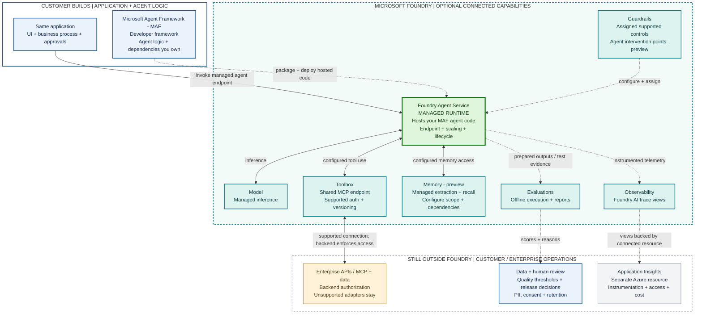

# C. Optional Deeper Integration

**Message:** After B's selected Guardrails + Evaluations, consume more Foundry capabilities only where agent hosting, repeated tool connections, long-term memory, trace investigation or adversarial testing becomes an operational bottleneck. Each is an independent adoption decision. C is not a target state and is not automatically better than B.

**Compose around the managed runtime:** Build agent logic with Microsoft Agent Framework (MAF), package that code as a hosted agent, and let Foundry Agent Service manage its endpoint, scaling and runtime lifecycle. Model, Toolbox, Memory, Guardrails, Evaluations and observability are connected capabilities with distinct configuration and access requirements, not a mandatory bundle. MAF can also run externally; Agent Service can host other compatible frameworks.



**Legend:** Blue is customer-authored application/agent logic; green is the managed runtime; teal blocks are configured platform capabilities. Solid arrows show runtime exchanges; dotted arrows show deployment, policy assignment, offline evaluation or telemetry dependencies as labeled. MAF's deployment arrow is not a runtime network hop. Evaluation does not sit in the request path. The dashed Foundry boundary marks this entire composition as optional, not as one private network or billing boundary. This is not a tested deployment template; validate the chosen model/runtime/API combination and [availability constraints](../architecture-validation.md).

| SEPARATE STACK | MORE MANAGED FOUNDRY |
|---|---|
| Host, scale and monitor an independent agent-serving layer | Agent Service operates the supported runtime; developers maintain MAF agent/business logic |
| Repeat supported tool adapters and credential handling per consumer | Toolbox exposes reusable connections with configured auth and version management |
| Maintain selected memory pipelines, scoring jobs and AI trace views | Compose managed memory, evaluations and trace views around the runtime |
| Coordinate each selected platform integration independently | Reduce selected application-owned boundaries; reuse platform management where supported |

**The benefit is less AI-platform infrastructure and integration to maintain, not less responsibility for application correctness.** Connection configuration, permissions, networking, failure handling, code upgrades, monitoring and release decisions do not disappear. AI Red Teaming remains an independent optional offline workflow in the table below; it is not required to compose these blocks.

**What does not move:** The whole application, business process, enterprise APIs and authoritative data do not move into Foundry. Authorization, approvals/consent, PII/domain controls, data governance and human decisions remain customer responsibilities. Application Insights remains a separate resource; Foundry provides the AI tracing experience over collected telemetry, not a replacement telemetry backend.

## ASCII Fallback

```text
CUSTOMER:  Same application                  MAF agent logic [framework]
                        | invoke                           : package + deploy
                        v                                  v
FOUNDRY:   [Agent Service: managed runtime hosting your code]
                          ^ assigned Guardrails at supported intervention points
                  |         |          |          :              :
              [Model]   [Toolbox]   [Memory]  [Evaluations]  [Trace views]
                                |        preview      :              :
                                |                     v              v
                                v                 Customer      App Insights
                      Enterprise APIs/MCP      release       [separate resource]
                      + authorization         review

Solid paths: configured runtime exchanges. Dotted paths: setup/offline/telemetry.
Policy assignment targets the supported runtime/model path, not every action.
KEPT: business logic + dependencies + PII + consent + permissions + operations
```

## Potential Consolidation

| Capability | Before / independently operated | With deeper Foundry adoption | What becomes simpler | Customer still owns |
|---|---|---|---|---|
| **1. Agent Service** | Operate agent compute/hosting, scaling and runtime lifecycle infrastructure around the chosen framework | Use managed prompt-agent execution or hosted code-based agents where the execution model fits | Reduce operation of a separate agent-serving platform for the supported runtime scope; no need to move the UI or entire application | Business logic, agent instructions/code, workflow semantics, dependency maintenance, compatibility tests, deployment/release choices, approvals and failure recovery |
| **2. Toolbox** | Repeat tool definitions, adapters and supported authentication/connection setup across agent consumers | Configure shared tools and supported connections exposed through an MCP-compatible endpoint | Reuse supported tool integrations instead of maintaining each consumer's connection plumbing independently; external runtimes can use it too | Tool implementations, API contracts, identity/connection configuration, least privilege, backend authorization, consent, network policy and unsupported adapters |
| **3. Memory (preview)** | Build and operate a long-term memory store plus extraction/update/retrieval pipeline | Use managed memory extraction and scoped recall where supported, including direct Memory Store APIs | Avoid maintaining that custom memory pipeline/store for the covered use case; not a replacement for all data infrastructure | Chat/embedding dependencies and cost, memory scope/isolation, consent, retention/deletion, PII controls and recall correctness; authoritative data and conversation-history requirements remain separate |
| **4. Foundry tracing + Application Insights** | Build custom AI trace exploration views and investigation workflows over instrumented spans | Use the Foundry AI trace experience backed by connected Application Insights | Reduce custom AI-specific trace-view development and investigation work for supported spans; this does not eliminate telemetry collection or every existing dashboard | Instrumentation/custom spans, context propagation, Application Insights configuration, redaction, access/retention, costs, alerts, existing observability and end-to-end operations |
| **5. AI Red Teaming (preview)** | Maintain automated adversarial prompt generation, attack orchestration, scoring and report aggregation, or integrate an external workflow | Use supported Foundry automated attacks and test reporting through a compatible workflow | Reduce custom adversarial test-harness and report plumbing for covered targets/strategies; testing remains separate from runtime Guardrails and B's evaluations | Target adapter/access, test authorization and scope, datasets, compatibility checks, human security testing, findings triage, remediation and release gates |

**Scope of the claim:** These are potential reductions for a customer whose requirements match the supported capability. Existing shared services may already handle the work effectively. Fewer custom integrations do not establish lower total cost, complete feature parity or better architecture; account for migration, service configuration, preview limitations and ongoing governance before retiring anything.

**Evaluation continuity:** B's hypothetical scenario already selected Foundry Evaluations, so C does not add another evaluation platform or count evaluation consolidation again. A customer with an existing evaluation investment can retain it; migration or dual operation is not required. AI Red Teaming is a separate optional adversarial testing decision.

## When This Is Justified

- **Runtime:** The team wants managed hosting, scaling, conversations, and lifecycle. Choose a configuration-based prompt agent or a hosted code-based agent according to the required execution model. Neither implements the business process for you.
- **Microsoft Agent Framework:** A developer framework, not another managed service. Customer-authored hosted code can use it or another supported framework. It can also run outside Foundry; do not draw MAF itself as a mandatory cloud boundary.
- **Toolbox:** Reuse approved tools and supported authentication connections across consumers. It can also be adopted directly from B by external MCP-compatible runtimes; moving runtime is not a prerequisite. Tool definitions and authentication need configuration, and enterprise APIs still enforce permissions. Client-side function calling is not automatically hosted by Toolbox.
- **Memory (preview):** Consider managed long-term memory only when cross-session context creates measurable value. Direct Memory Store APIs also support selective adoption without migrating the runtime. Compatible chat and embedding deployments are required; memory stores currently do not support VNet integration. Do not confuse memory with conversation history or an authoritative enterprise database.
- **Evidence and tracing:** Evaluation and preview AI Red Teaming are separate test workflows. The local red-team SDK guide explicitly warns it is incompatible with the new Foundry portal/SDK; this box is a capability option, not a claim that that local runner feeds the new portal. Prompt/hosted-agent tracing is GA after connecting Application Insights; custom application spans require instrumentation, and external/workflow agent tracing is preview.

Agent guardrails can override the underlying model guardrail rather than add another cumulative layer. Explicitly configure applicable intervention points. Tool scanning is not authorization, and hosted code's arbitrary outbound actions must not be assumed intercepted.

## Customer Still Owns

- Agent instructions/code, workflow semantics, model choice, compatibility tests, failure recovery, and dependency maintenance for hosted code.
- Tool implementations, API contracts, consent, approval UX, least-privilege identities, backend authorization, and network policy.
- Memory scope selection, consent, deletion/retention policy, isolation tests, and correctness of recalled information.
- Evaluation and red-team scope, datasets, judge calibration, human review, remediation, and release gates.
- Telemetry instrumentation, sensitive-data redaction, retention, access control, costs, and end-to-end operations.

## Adoption Boundary

Remaining at B, or selecting only one C capability while keeping an external runtime, is a valid outcome. For each potential addition, compare the work transferred with its constraints, migration effort, and ongoing cost. The five options are not a migration checklist. This repository implements only the Model + Guardrails + Evaluations sample; C is conceptual.

Sources: [Agent Service](https://learn.microsoft.com/azure/foundry/agents/overview), [Agent Framework](https://learn.microsoft.com/agent-framework/overview/), [Toolbox](https://learn.microsoft.com/azure/foundry/agents/concepts/toolbox-overview), [tracing](https://learn.microsoft.com/azure/foundry/observability/concepts/trace-agent-concept).